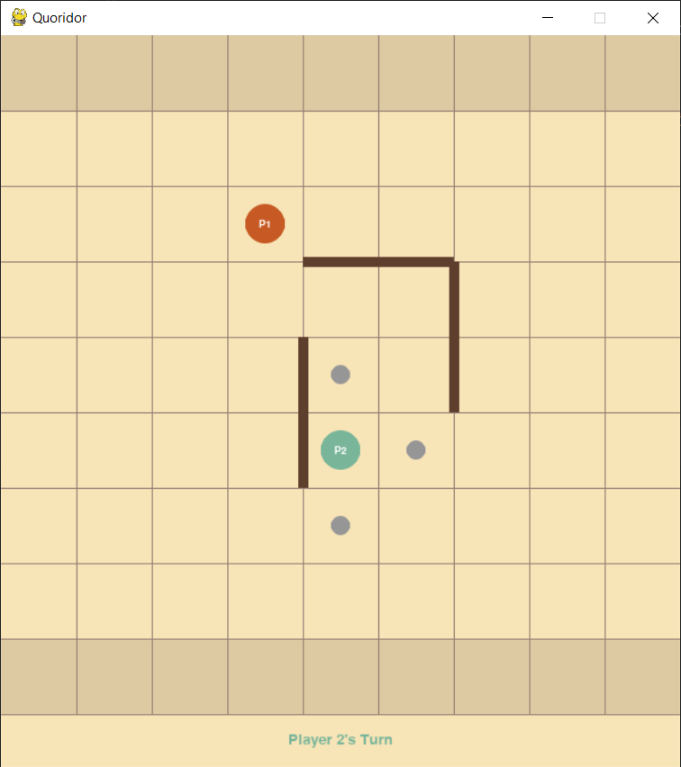

# Quoridor

A board game implementation written in Python with a graphical user interface via the Pygame library.

Details about the game, validation rules, implementation, game play and extra credit are below.

## Game

More information about the game and its rules can be found [here](https://en.wikipedia.org/wiki/Quoridor).

GUI shows current pawn and fence positions, possible moves for current player, and whose turn it is:

If a player makes a winning move, the game is stopped and the winner is announced:

